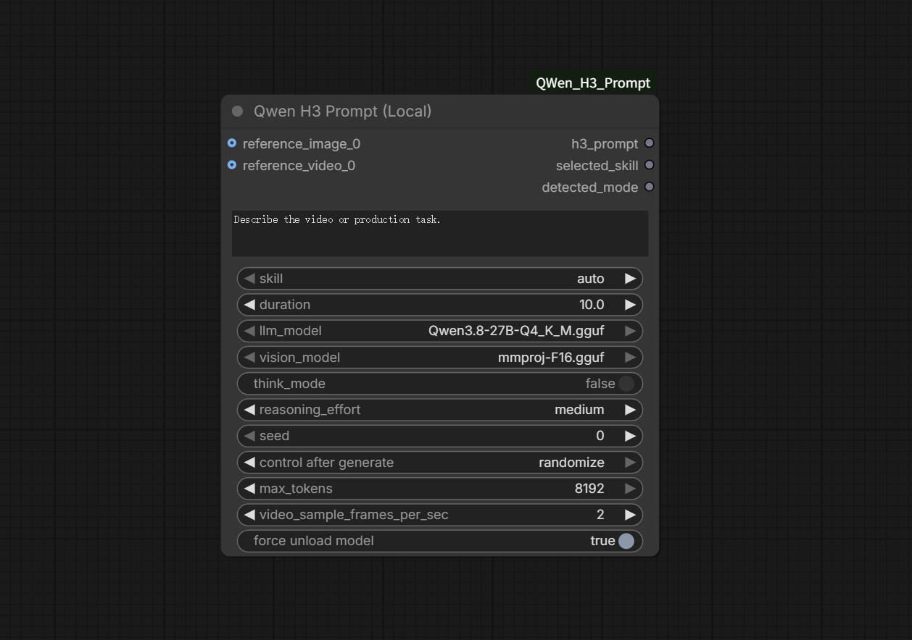

# ComfyUI Qwen H3 Prompt

在 ComfyUI 内使用本地 Qwen3.8-27B 和 MiniMax-H3 官方 Skill 生成 H3 提示词与制作方案。    
节点在 ComfyUI 内启动独立的本地 `llama-server`，推理过程不访问网络。运行完成后结束外部进程，释放GPU显存和系统内存（`force unload model`开启时），不占用ComfyUI内部资源。

## 官方 Skill 的本地适配边界

`h3-prompt-writing` 官方声明可直接移植。其余 Skill 原本依赖 MiniMax Hub 的画布、选择卡和媒体生成工具。本节点保留官方 Skill 内容作为创意与领域指导，但统一跳过素材收集、选择卡、审批门槛和媒体生成步骤，只输出符合当前输入模式与时长的最终 H3 prompt。

与 MiniMax H3 官方 Skills 不同，本节点所使用的 Qwen3.8-27B GGUF 模型不具备分析声音的能力，不能准确提取已有音乐的旋律、BPM、歌词、音色或节拍点。有关声音的提示词只是“创作声音的描述”，不是分析或复刻参考音频。

节点不会输出澄清问题、确认请求、备选方案、pre-production package 或下一步建议。用户未提供的可选内容会直接省略，例如画面文案、口号、品牌声明、对白、旁白和歌词；生成视频不可缺少但未指定的纯创意细节，则根据请求与参考媒体采用一个保守的确定值。


## 安装llama-server runtime

项目只提供一个跨平台安装入口 `install_runtime.py`。它仅使用 Python 标准库，自动识别 Windows、Linux 或 macOS、x64/ARM64 架构及显卡，并为当前机器部署固定的 llama.cpp `b10436` runtime，不需要安装额外的 pip 包。

Windows ComfyUI 官方便携包在节点目录中执行：

```
cd ComfyUI\custom_nodes\ComfyUI_QWen_H3_Prompt
..\..\..\python_embeded\python.exe install_runtime.py
```

Linux 与 macOS 使用Python执行：

```
python install_runtime.py
```

首次启动前必须先执行安装器。安装器会依次完成硬件检测、后端选择、下载、SHA256 校验、安全解压、`llama-server --version` 与 `--list-devices` 验证，最后生成本机专用的 `runtime_config.json`。下载缓存、源码缓存和安装结果都保存在节点的 `runtime/` 目录中。

安装器命令：

```
# 只显示检测结果和计划，不下载或安装
python install_runtime.py --dry-run

# 查看当前系统和架构支持的后端
python install_runtime.py --list-backends

# 手动指定后端
python install_runtime.py --backend vulkan

# 强制重新安装
python install_runtime.py --force

# 只使用 runtime/.downloads/b10436 中已经校验的文件
python install_runtime.py --offline
```


### 自动后端选择

| 系统和设备 | 自动顺序 |
| --- | --- |
| Windows x64 NVIDIA | CUDA 12.4 → Vulkan → CPU |
| Windows x64 AMD | ROCm 7.14 → Vulkan → CPU |
| Windows x64 Intel | SYCL → Vulkan → CPU |
| Windows x64 未识别 GPU | Vulkan → CPU |
| Windows ARM64 NVIDIA | CUDA 13.4 preview → CPU |
| Windows ARM64 Qualcomm Adreno | OpenCL → CPU |
| Linux x64 Intel | SYCL FP16 → Vulkan → CPU |
| Linux x64 NVIDIA/AMD/未识别 GPU | Vulkan → CPU |
| Linux ARM64 | Vulkan → CPU |
| macOS Apple Silicon 或 Intel | Metal → CPU |

Windows 可用后端取决于架构，包括 `cuda12`、`cuda13`、`rocm`、`sycl`、`vulkan`、`opencl` 和 `cpu`。

Linux 官方预编译后端包括 `vulkan`、`sycl`、`sycl-fp32`、`openvino` 和 `cpu`，具体选项取决于架构。官方文件是 Ubuntu 构建，其他发行版需要兼容的 glibc/libstdc++。Vulkan、Intel SYCL/OpenVINO 还需要系统中已经存在相应的显卡驱动和运行库。

macOS 使用对应架构的官方包。Metal 不需要额外 GPU 计算框架，但 Qwen3.8-27B Q4 和视觉投影器仍需要足够的统一内存。

### Linux CUDA 源码部署

官方 `b10436` 没有提供 Linux CUDA 压缩包。NVIDIA Linux 用户可显式要求安装器从源码构建：

```
python install_runtime.py --backend cuda --build-from-source
```

源码构建不会调用 `sudo` 或自动修改系统。运行前必须已经具备：

- 可正常运行 `nvidia-smi` 的 NVIDIA 驱动；
- 包含 `nvcc` 的 NVIDIA CUDA Toolkit，`nvcc` 位于 `PATH` 中或已经设置 `CUDA_HOME`；
- Git、CMake、C 编译器和 C++ 编译器，例如 Ubuntu/Debian 的 `git cmake build-essential`。

## 模型目录
把 Qwen3.8 视觉模型权和GGUF权重文件放到```ComfyUI/models/LLM/Qwen3.8/```目录。
* 视觉权重：
  从 https://huggingface.co/unsloth/Qwen3.8-27B-GGUF 下载 ```mmproj-F16.gguf```
* GGUF权重：   
  对于20G以上显存的设备，推荐从 https://huggingface.co/unsloth/Qwen3.8-27B-GGUF 下载 ```Qwen3.8-27B-Q4_K_M.gguf``` 或者 ```Qwen3.8-27B-Q6_K.gguf```。    
  对于16G显存的设备，推荐 https://huggingface.co/soyaakinohara/qwen3.8-27b-abliterated-3.69bpw-12GB-MTP.gguf 。    
  也可以自行下载其他与llama-server兼容的Qwen3.8权重。


## 节点
启动ComfyUI，在 `😺dzNodes/QWen_H3_Prompt` 分类中添加 `Qwen H3 Prompt (Local)`节点。
  

节点选项说明：
- `skill`：`auto` 或9个官方 Skill。设为auto时自动选择Skill路由。
- `duration`：目标 H3 视频时长，默认 `10.0` 秒，取值范围4~15秒。
- `think_mode`：布尔开关，默认关闭；自动在 Qwen 官方 instruct 和 thinking 推荐参数之间切换。
- `reasoning_effort`：仅在 `think_mode` 开启时生效，默认 `medium`。
- `seed`：种子。
- `reference_images`：动态添加 0-9 张独立 IMAGE。每个插槽只接受一张图片；图片角色由数量和用户提示词共同决定。
- `reference_videos`：动态添加 0-3 路 IMAGE 批次，内部固定按 24 fps 计算时长和采样时间。
- `video_sample_frames_per_sec`：每路参考视频每秒抽取的帧数，默认值为 2。
- `force unload model`：默认开启。开启时每次完成后终止内置 llama-server服务并强制清理内存和显存；关闭时保留模型供下一次运行复用。发生错误时无论选项状态都会强制释放。

### 图片输入与模式路由

节点按照以下规则选择 H3 模式：

| 输入 | 判定方式 |
| --- | --- |
| 没有图片和视频 | 直接使用 T2VA |
| 1 张图片、没有视频 | Qwen 根据用户提示词选择 I2VA、L2VA 或 Ref2VA |
| 2 张图片、没有视频 | Qwen 根据用户提示词选择 FL2VA 或 Ref2VA |
| 3-9 张图片 | 直接使用 Ref2VA |
| 连接任意参考视频 | 直接使用 Ref2VA |

一到两张图片时，节点不会仅根据图片数量猜测首尾帧。要生成关键帧模式提示词，必须在用户提示词中明确说明图片的时间角色：

```text
# 一张首帧图，路由为 I2VA
将 Picture 1 作为目标视频的首帧，从这个画面继续向前发展。

# 一张尾帧图，路由为 L2VA
将 Picture 1 作为目标视频最后一帧，设计一个自然抵达该画面的过程。

# 两张首尾帧图，路由为 FL2VA
Picture 1 是目标视频首帧，Picture 2 是目标视频尾帧，生成从前者连续过渡到后者的过程。
```

如果一到两张图片只是人物、产品、场景、构图或风格参考，也应明确说明其参考作用，节点会选择 Ref2VA：

```text
参考 Picture 1 的人物身份和服装，参考 Picture 2 的场景与灯光，创作一段产品宣传短片；两张图都不是首尾帧。
```

### 参考视频

`reference_videos` 最多连接 3 路，每一路都是按时间顺序排列的 IMAGE batch。单段视频按 24 fps 计算后必须为 2-15 秒，全部参考视频总时长不能超过 15 秒。

`video_sample_frames_per_sec` 表示从每路视频的每一个一秒时间窗中均匀抽取多少帧，它不是整段视频的总抽帧数，也不会改变最终 H3 视频的帧率。

默认值 `2` 适合大多数动作和运镜。静态产品展示可以使用 `1`；快速动作、复杂转场可提高到 `3-8`。数值越高，每秒保留的动作细节越多，但联系表中单帧面积会变小，同时增加图片编码、内存和推理开销。

连接参考视频后始终使用 Ref2VA。当前接口只接收视频画面帧，不会读取视频文件中的音轨。

### 原创声音与配乐描述

Qwen 会根据用户提示词、目标时长、参考图片以及参考视频的抽样画面，自动创作与画面匹配的声音设计：

- 描述环境声、动作声、空间感和随画面变化的声音事件。
- 描述原创器乐配乐的情绪、乐器、速度、发展、关键画面同步点和收束方式。
- 没有用户明确提供时，不会自行编造对白、旁白、歌词或人声演唱。
- 用户只要求“无背景音乐”时，输出 `non_diegetic_music: N/A`，但仍保留合理的环境声和动作声。
- 用户明确要求“完全静音”“全程静音”或“不要任何声音”时，强制输出 `overall_soundscape: N/A` 和 `non_diegetic_music: N/A`。

这属于根据视觉内容创作新的音频描述，不是分析、复刻或保留参考视频原声。生成的文本最终交给 MiniMax H3 合成原生声音。


## 显存和生命周期
若关闭 `force unload model`，内置服务会继续占用约 20 GB 显存，模型配置不变时下一次可直接复用；再次开启并运行节点、模型配置发生变化或退出 ComfyUI 时会终止驻留服务。


## 上游来源与许可证

- MiniMax H3 Skill 来自 [`MiniMax-AI/MiniMax-H3`](https://github.com/MiniMax-AI/MiniMax-H3) commit `d21241f0a4b3acbb34c97dae47fa417b7065e438`，官方文件保存在 `skills/`。
- 跨平台runtime安装器固定使用 llama.cpp `b10436`，对应完整 commit `6fed9f6ff7a603b124cb8c5864fca6ea879f9f99`，并对下载文件执行 SHA256 校验。
- Linux CUDA 源码构建使用同一固定 tag 和 commit。llama.cpp 的 MIT 许可证保存在 `third_party/llama.cpp-LICENSE`。
- 本项目仅为学习研究使用，如果作为商业用途，请查阅相关原项目授权协议。